# C++动态链接库使用

#### 学习目标

>1. 学会使用 Google Test 来编写单元测试用例
>2. 学会使用 Nuget 来管理第三方库
>3. 学会标准模板库 STL 中 `std::string` 和 `std::vector` 的基本用法
>4. 动态链接库的编写

#### 开发环境

* Visual Studio 2022
* Google Test

#### 具体内容

创建一个动态链接库，在其中实现如下函数：

```cpp
std::vector<std::string> splitString(const std::string& vInput, char vSeperator);
```

 例如，字符串 “dadf,sdfe,few” 使用分隔符 ',' 进行分割，得到三个子串 “dadf”，“sdfe”，“few”。

>[!note] 注意
>
>1. 假设字符串中不出现中文字符
>2. 使用 Nuget 来安装 Google Test

#### 提交材料

1. 动态链接库工程，包含 `splitString()` 函数的实现；
2. Google Test工程，针对 `splitString()` 函数的测试用例；

#### 建立过程

1. **创建DLL项目**。在“配置新项目”页面，在“项目名称”框中输入“MyStringSplit2”，以指定项目的名称 。 保留默认“位置”和“解决方案名称”值 。 将“解决方案”设置为“创建新解决方案” 。 如果“将解决方案和项目放在同一目录中”已选中，则取消选中 。

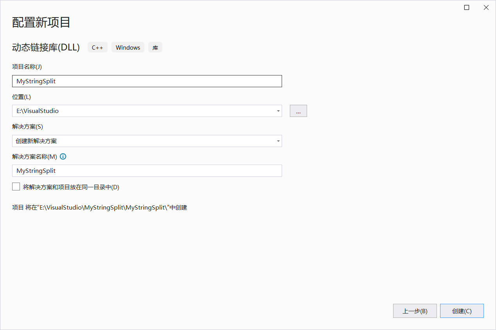

2. **将头文件添加到 DLL**。在“添加新项”对话框的左窗格中，选择“Visual C++” 。 在中间窗格中，选择 **“头文件(.h)”** 。 指定 MyStringSplit.h 作为头文件的名称 。

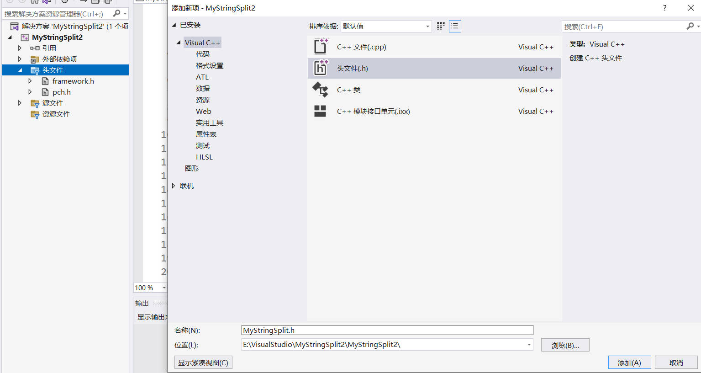

3. **将头文件换成如下代码**。

   ```c++
   ##pragma once
   #include <vector>
   #include <string>
   
   #ifdef BUILD_MYSTRINSPLITGDLL
   #define API_SYMBOL __declspec(dllexport)
   #else
   #define API_SYMBOL __declspec(dllimport)
   #endif // BUILD_MYSTRINGSPLITDLL
   
   extern "C++" API_SYMBOL std::vector<std::string> splitString(const std::string & vInput, char vSeperator);
   ```

   请注意文件顶部的预处理器语句。 DLL 项目的新项目模板会将 `<PROJECTNAME>_EXPORTS` 添加到定义预处理器宏。 在此示例中，Visual Studio 在生成 MathLibrary DLL 项目时定义 `MATHLIBRARY_EXPORTS`。

   定义 `MATHLIBRARY_EXPORTS` 宏时，`MATHLIBRARY_API` 宏会对函数声明设置 `__declspec(dllexport)` 修饰符。 此修饰符指示编译器和链接器从 DLL 导出函数或变量，以便其他应用程序可以使用它。 如果未定义 `MATHLIBRARY_EXPORTS`（例如，当客户端应用程序包含头文件时），`MATHLIBRARY_API` 会将 `__declspec(dllimport)` 修饰符应用于声明。 此修饰符可优化应用程序中函数或变量的导入。 有关详细信息，请参阅 [dllexport、dllimport](https://learn.microsoft.com/zh-cn/cpp/cpp/dllexport-dllimport?view=msvc-170)。

4. **向 DLL 添加实现**。将光标指向`splitString`，按下ALT+ENTER，会自动创建实现的cpp文件，如若不行，可手动添加源文件cpp，命名为`MyStringSplit`。向cpp文件中添加如下代码。

   ```C++
   #include "pch.h"
   #include "MyStringSplit.h"
   
   std::vector<std::string> splitString(const std::string& vInput, char vSeperator)
   {
   	int subIndex = 0;
   	std::vector<std::string> result;
   	std::string cutString, lastString;
   	for (int i = 0; i < vInput.size(); i++){
   		if (vInput[i] == vSeperator) {
   			cutString = vInput.substr(subIndex, i - subIndex);
   			if (cutString != "") {
   				result.push_back(cutString);
   			}
   			subIndex = i + 1;
   		}
   	}
   	lastString = vInput.substr(subIndex);
   	if (lastString != "") {
   		result.push_back(lastString);
   	}
   	return result;
   }
   ```

   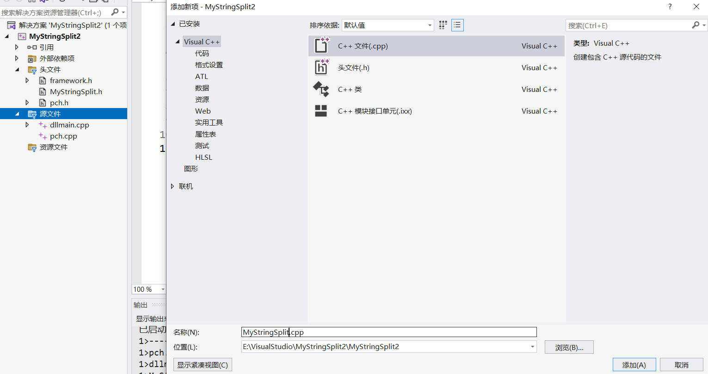

5. **创建Google Test项目**。右键解决方案->添加->新建项目，项目名称命名为StringSplitTest,创建使用链接库、动态链接，测试的项目为MyStringSplit2

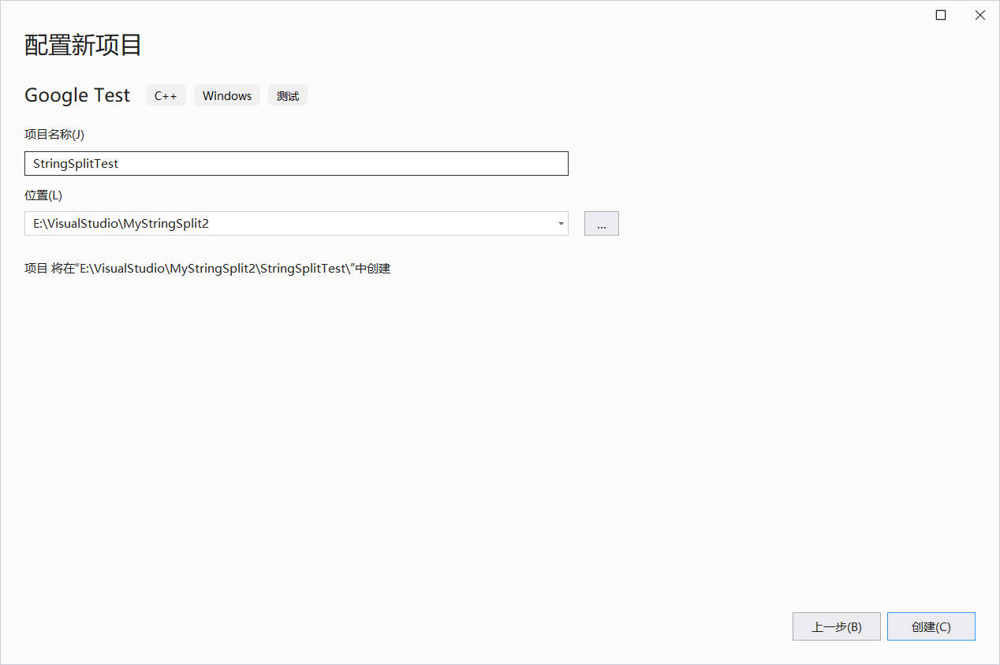

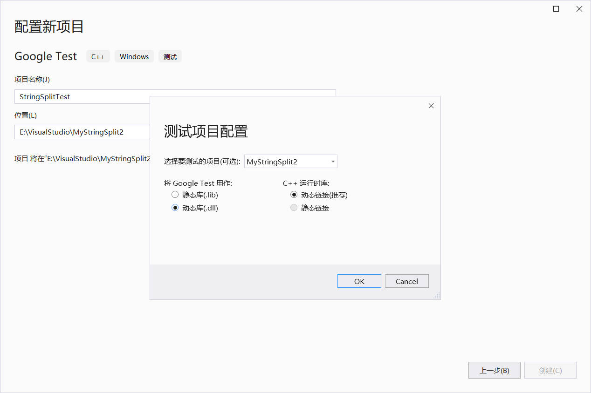

6. **在test.cpp中添加测试代码**。

   ```c++
   #include "pch.h"
   #include "MyStringSplit.h"
   
   TEST(SpringTestCase, NormalSplit1)
   {
   	std::vector<std::string> res{"Hello", "C++", "World"};
   	std::vector<std::string> testRes = splitString("Hello,C++,World", ',');
   	ASSERT_EQ(res, testRes);
   }
   
   TEST(SpringTestCase, NormalSplit2)
   {
   	std::vector<std::string> res{"Hello", "C++", "World"};
   	std::vector<std::string> testRes = splitString(",,Hello,,C++,,World,,", ',');
   	ASSERT_EQ(res, testRes);
   }
   
   TEST(SpringTestCase, EmptySplit1)
   {
   	std::vector<std::string> res{"Hello", "C++", "World!"};
   	std::vector<std::string> testRes = splitString("  Hello C++ World! ", ' ');
   	ASSERT_EQ(res, testRes);
   }
   
   TEST(SpringTestCase, EmptySplit2)
   {
   	std::vector<std::string> res{};
   	std::vector<std::string> testRes = splitString("    ", ' ');
   	ASSERT_EQ(res, testRes);
   }
   
   TEST(SpringTestCase, EmptyString)
   {
   	std::vector<std::string> res{};
   	std::vector<std::string> testRes = splitString("", ',');
   	ASSERT_EQ(res, testRes);
   }
   
   TEST(SpringTestCase, NoSplit)
   {
   	std::vector<std::string> res{"Hello,C++,World!"};
   	std::vector<std::string> testRes = splitString("Hello,C++,World!", '.');
   	ASSERT_EQ(res, testRes);
   }
   ```

7. **配置测试项目的包含目录**。（此处可能有冗余操作）

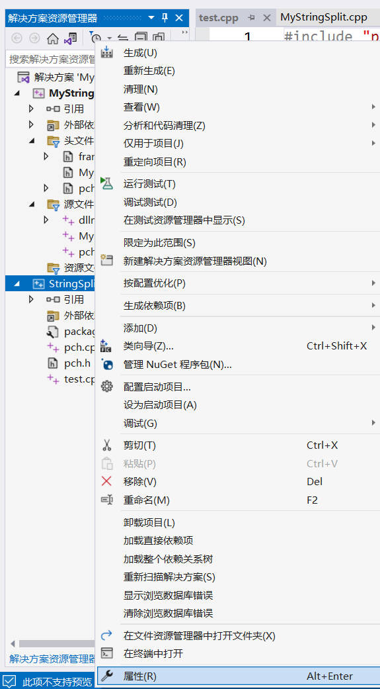

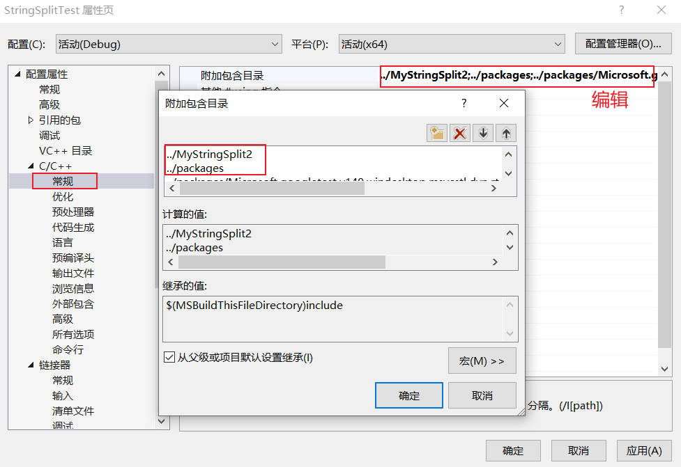

配置C++附加包含目录时，记得用相对路径，分别添加`../MyStringSplit2`,`../packages`,`../packages/Microsoft.googletest.v140.windesktop.msvcstl.dyn.rt-dyn.1.8.1.7/build/native/include`,注意，初始建立项目时并没有将解决方案添加到项目中，所以这里相对引用时`../`，添加后两个，纯粹时因为git clone文件时，test.cpp和pch.h中有`#include <gtest/gtest.h>`的波浪线。

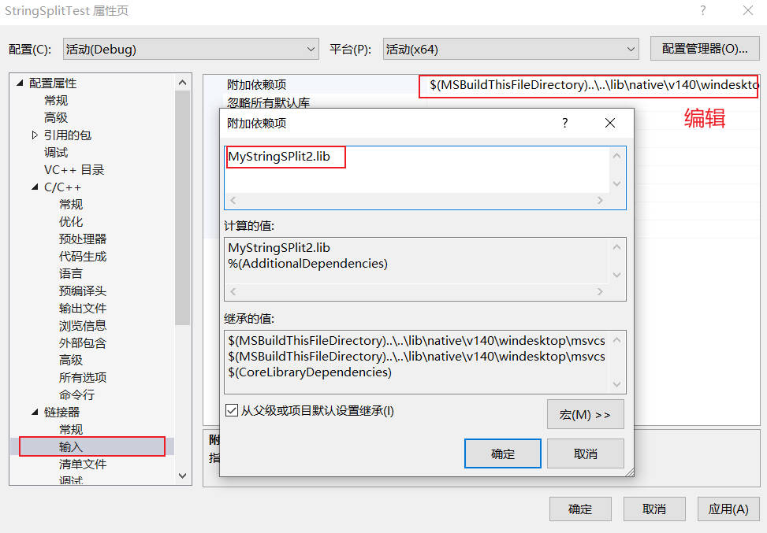

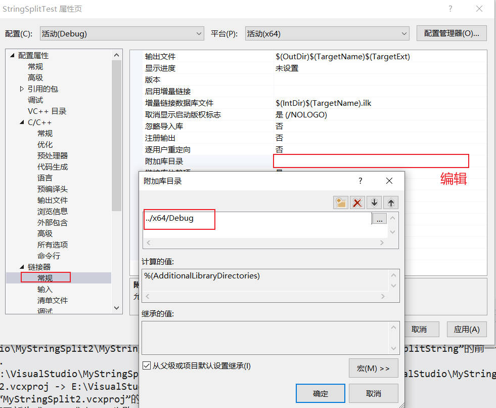

如果用的生成方案是x86,那么链接器常规中附加库目录是`../Debug`即可。

8. **生成解决方案，进行测试**。

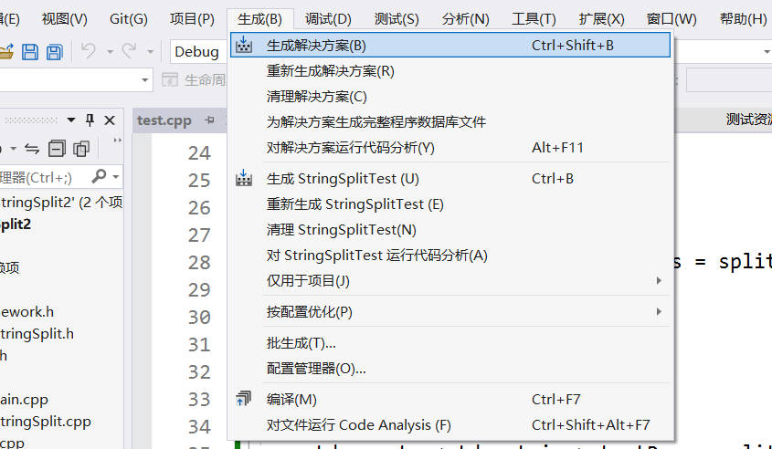

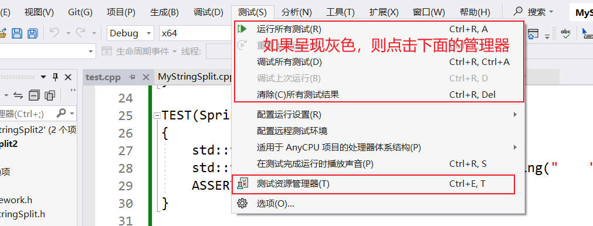

#### 如何使用

1. 点击菜单栏 "生成" -> "生成解决方案"；
2. 点击菜单栏"测试"  -> "运行所有测试"，如果呈现灰色，则如上图点击"测试资源管理器"，运行所有测试即可，最终结果如下图所示。

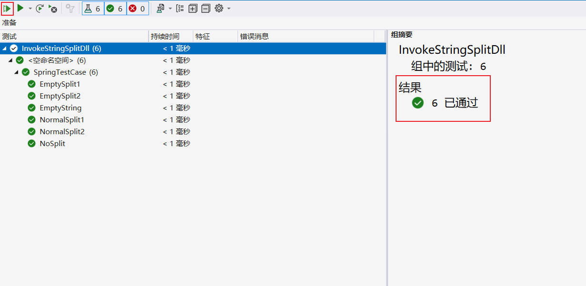

#### 参考资料

1. [演练：创建和使用自己的动态链接库 (C++)](https://learn.microsoft.com/zh-cn/cpp/build/walkthrough-creating-and-using-a-dynamic-link-library-cpp?view=msvc-170)
2. [vs2022创建和使用自己的动态链接库 (C++)演示](https://www.bilibili.com/video/BV1XX4y1d7L3/)
3. [Visual Studio 2019-编写C++动态链接库](https://www.bilibili.com/video/BV1k541177AS/)

